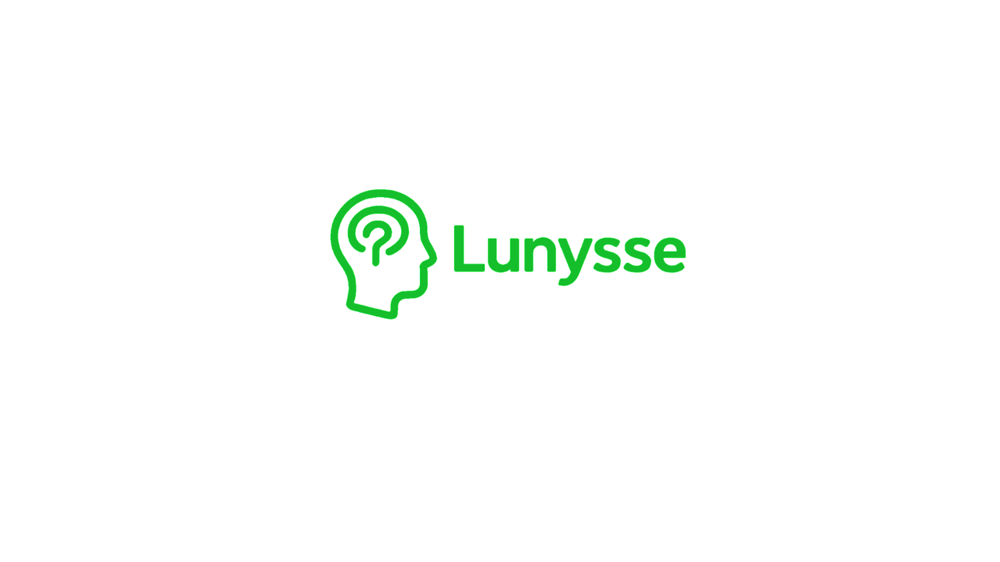

# 🧠 Lunysse – Sistema de Agendamento Psicológico

Sistema web moderno para gestão de consultas psicológicas, desenvolvido com **React 19 + Vite**, voltado para atendimentos voluntários em **universidades, ONGs e projetos sociais**.  
O projeto oferece **interfaces distintas para psicólogos e pacientes**, com foco em acessibilidade, eficiência e usabilidade.



[](CHANGELOG.md)
[](https://reactjs.org/)
[](https://vitejs.dev/)
[](https://tailwindcss.com/)

---

## 📋 Índice
- [Sobre o Projeto](#sobre-o-projeto)
- [Funcionalidades](#funcionalidades)
- [Tecnologias](#tecnologias)
- [Instalação](#instalação)
- [Uso](#uso)
- [Estrutura do Projeto](#estrutura-do-projeto)
- [API Mock](#api-mock)
- [Chat com IA](#chat-com-ia)
- [Design System](#design-system)
- [Rotas](#rotas)
- [Scripts](#scripts)
- [Contribuição](#contribuição)
- [Licença](#licença)

---

## 🎯 Sobre o Projeto
O **Lunysse** foi criado para simplificar o processo de **agendamento e acompanhamento de consultas psicológicas**.  
Seu objetivo é apoiar psicólogos voluntários e pacientes com uma ferramenta confiável, responsiva e fácil de usar.

**Principais objetivos:**
- Facilitar o agendamento de consultas
- Fornecer dashboards personalizados
- Manter histórico clínico organizado
- Oferecer relatórios visuais interativos
- Integrar IA especializada em psicologia clínica

---

## ✨ Funcionalidades

### 👨‍⚕️ Psicólogos
- Dashboard com KPIs e próximos atendimentos  
- Gestão de pacientes e histórico clínico  
- Relatórios interativos e analytics  
- Agenda configurável por psicólogo  
- Chat com IA especializada  

### 👤 Pacientes
- Dashboard simplificado  
- Agendamento de sessões em tempo real  
- Seleção de psicólogo por especialidade  
- Histórico de atendimentos  

### 🔐 Autenticação
- Login e registro validados  
- Perfis distintos (psicólogo / paciente)  
- Proteção de rotas  
- Interface de login com **glassmorphism**  

---

## 🛠 Tecnologias

### Frontend
- React 19.1.1  
- Vite 7.1.0  
- React Router DOM 7.8.0  
- Tailwind CSS 4.1.11  
- Framer Motion 12.23.12  
- Lucide React 0.539.0  
- Recharts 3.1.2 & Chart.js 4.5.0  
- React Hot Toast 2.5.2  

### IA
- Hugging Face Inference API  
- Modelo: **zai-org/GLM-4.5**  

### Persistência
- LocalStorage  
- API Mock simulando backend  

---

## 🚀 Instalação

### Pré-requisitos
- Node.js 18+  
- npm ou yarn  

### Passos
```bash
# Clone o repositório
git clone https://github.com/seu-usuario/sistema-agendamento-psicologico.git
cd sistema-agendamento-psicologico

# Instale dependências
npm install

# Configure variáveis de ambiente
cp .env.example .env
# adicione seu token do Hugging Face

# Rode o servidor
npm run dev
Acesse em: http://localhost:5173

💻 Uso
Contas de Teste
Psicólogos

João Silva — psicologo@test.com / 123456

Ana Costa — ana@test.com / 123456

Carlos Mendes — carlos@test.com / 123456

Lucia Ferreira — lucia@test.com / 123456

Paciente

Maria Santos — paciente@test.com / 123456

📂 Estrutura do Projeto
Conforme a organização atual do repositório:

csharp
Copiar código
public/
  logo.png
src/
  assets/
    react.svg
  components/        # Componentes reutilizáveis (UI, Navbar, Sidebar, etc.)
  context/           # Contextos globais (ex: autenticação)
  pages/             # Páginas principais
    About.jsx
    Agendamento.jsx
    ChatIA.jsx
    DashboardPaciente.jsx
    DashboardPsicologo.jsx
    Historico.jsx
    Home.jsx
    Login.jsx
    NotFound.jsx
    PacienteDetalhe.jsx
    Pacientes.jsx
    Register.jsx
    Relatorios.jsx
    SessaoDetalhes.jsx
    Solicitacoes.jsx
  routes/
    AppRoutes.jsx     # Definição das rotas
  services/          # Serviços (IA, API mock)
App.jsx
main.jsx
index.css
🔌 API Mock
Autenticação (login, register)

Usuários (getPsychologists)

Pacientes (getPatients)

Agendamentos (getAppointments, createAppointment, updateAppointment, cancelAppointment)

Sessões (getSessionDetails, updateSessionNotes)

Relatórios (getReportsData)

Dados persistidos em localStorage:

lunysse_users

lunysse_patients

lunysse_appointments

🤖 Chat com IA
Modelo: zai-org/GLM-4.5

Suporte a respostas em markdown

Histórico de até 10 mensagens

Sugestões clínicas baseadas em evidências

Tratamento de erros (rede, autenticação, token inválido)

🎨 Design System
Paleta
Azul escuro: #010440

Azul médio: #024873

Azul claro: #2493BF

Accent: #26B0BF

Bege claro: #F2EFE9

Tipografia
Inter

Nunito

Roboto Mono

Componentes
Button – variantes: primary, secondary, danger

Card – glassmorphism, sombras suaves

Modal – overlay com blur

Sidebar / Navbar – navegação adaptativa

🛣 Rotas
Públicas
/ → Home

/about → Sobre

/login → Login

/register → Cadastro

Protegidas
/dashboard → redireciona por perfil

/agendamento → pacientes

/pacientes → psicólogos

/pacientes/:id → detalhes do paciente

/sessao/:id → detalhes da sessão

/chat-ia → psicólogos

/relatorios → psicólogos

🔧 Scripts
bash
Copiar código
npm run dev       # desenvolvimento
npm run build     # produção
npm run preview   # visualizar build
npm run lint      # análise de código